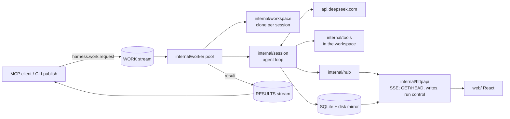

# Architecture

Where things live and what they may depend on. Why they are that way is
[`docs/DESIGN.md`](docs/DESIGN.md), and § references below point into it.

## Overview

A work request names a prompt, one or more repositories, and a permission mode.
The harness clones those repositories into a directory of its own, runs an agent
loop that reads and writes files and runs commands in there, and publishes a
result. Requests arrive over NATS JetStream; results go back over a second
stream. A browser can watch, change settings, and start, steer, and stop a run.
Start and stop act on the run through two declared seams
(docs/RUN-CONTROL.md): `RunPublisher`, a narrow interface declared in
`internal/httpapi` and implemented by `cmd/harness` over the queue's own
JetStream handle, publishes a validated work request to the WORK stream; and
`RunController`, declared in `internal/httpapi` and implemented by
`*worker.Pool`, ends a run in this process. Steer needs no seam at all — it is
a store write by the handler and a store read by the loop, with the database
as the boundary.

One binary, `harness`, is every entry point. One subcommand is a long-running
service and the rest are one-shot CLI:

- **`harness serve`** — the worker pool, the SQLite store, the HTTP
  surface, and the MCP launch server, in a single process. It serves the web
  UI, `/api/...`, and `/mcp` on one HTTP port; the embedded MCP service lets
  an external agent harness launch and collect runs on the same streams and
  the same HTTP API. It holds no database handle of its own — `serve` is the
  single writer. Concurrent sessions are goroutines, not child processes
  (§4.5).



One property shapes the arrangement: the head of every request — system prompt,
then tool array — is byte-identical across sessions and frozen for a session's
life, and the message array only ever grows at the end (§3.2). Packages are
split so that nothing on the request path can perturb that head. Skills render
into the opening user message rather than the system prompt. Permission changes
which tool calls *run*, never which tools are *offered*. A resumable session
stores the prompt and schema it was created with, so a harness upgrade cannot
rewrite its prefix.

## Codemap

### `cmd/harness`
Subcommand dispatch, flag parsing, and process wiring — one file per subcommand.
Composition happens here and nowhere else; no `internal` package constructs
another's dependencies.

### `internal/deepseek`
The API client. Request and response types as structs rather than maps, so
serialisation is byte-stable; SSE reading with an idle watchdog; the tool-call
assembler keyed by call index; retry classification. Knows nothing of sessions,
tools, or storage. Depends on: nothing internal. §4.3, §4.4.

### `internal/session`
The agent loop: sub-turn iteration, the system prompt, tool dispatch, ordering
of tool results, compaction, and resume. The widest dependency set in the repo,
deliberately — this is where everything meets. Consumed by `internal/worker` and
by the CLI's `run` and `resume`. §4.5, §4.6.

### `internal/tools`
Every tool the model can call: schemas matching the trained-in shape, argument
validation in Go, workspace confinement, per-tool timeouts and output caps, and
the permission policy that gates execution. Also owns the frozen tool
definitions the request head carries. The catalogue and its wording are
[`docs/TOOLS.md`](docs/TOOLS.md); a change here is a cache-prefix change.

### `internal/fold`
Folds the event log into the DeepSeek `messages` array. Pure, append-only, a
switch on event kind. Its counterpart is the frontend's own fold in
`web/src/api`, which walks the same log to produce display blocks. §4.1.

### `internal/store`
SQLite (`modernc.org/sqlite`, pure Go, WAL) plus the derived disk mirror under
`<data dir>/sessions/` and diff computation. The database is authoritative; the
mirror is rebuildable with `harness export`. The `settings` table holds the
harness's stored configuration — the DeepSeek API key among it — written and
read through `internal/settings`. Depends on: nothing internal. §4.8.

### `internal/hub`
In-process SSE fan-out: per-session transcript subscribers and a quieter
session-list subscriber set. Fed the same events a session appends. Touches no
JetStream — the browser reads the store and the hub, never NATS. §4.2, §5.8.

### `internal/httpapi`
The HTTP surface and the static file server for the embedded frontend. `GET`
and `HEAD` on every path, plus the write endpoints over the data the harness
manages (docs/DATA-API.md) and the run-control endpoints (docs/RUN-CONTROL.md).
Serves the store and the hub and writes through the store; the reach into the
run loop is through two declared seams rather than imports: `RunController`,
implemented by `*worker.Pool`, for the stop endpoint, and `RunPublisher`,
implemented by `cmd/harness` over the queue's own JetStream handle, for the
start endpoint — so this package still imports neither `session` nor `worker`
and holds no JetStream handle, only the narrow ability to enqueue one
validated request (it imports `queue` for the request type and its `Validate`,
deliberately, so a body validated here can never drift from the queue's).
Steering (`POST /api/sessions/{id}/steer`) needs no seam: it is a store write
the session loop reads at its next sub-turn boundary. §4.2.

### `internal/webassets`
`go:embed` of the built frontend, so the binary ships with no runtime assets.
`dist/` is Vite output and is not in git.

### `internal/queue`
JetStream wiring shared by every NATS caller: stream and consumer declaration,
the work request and result bodies, and the progress rate limiter. §4.10.

### `internal/worker`
The pool. Pulls a request, builds its workspace, runs it as a session,
publishes the result, then acks — in that order, so a crash redelivers rather
than loses. Owns acknowledgement discipline and idempotency against the
`work_requests` table. §4.10.

### `internal/workspace`
Prepares the per-session directory — a `scratch/` subdirectory for files that
are not part of the deliverable, and clones of the repositories a request
names — including the remote-URL restrictions that keep `ext::` and local
paths out. Each clone then gets its Node dependencies installed, with the
lockfile choosing the package manager; the install is best-effort and never
fails a run. §4.10.

### `internal/promptvariant`
The named alternatives to the shipped system prompt, and the reminder cadences
that go with them. Imports nothing internal but the wire vocabulary, which is
what lets `internal/queue` validate a variant name on a work request without
pulling the agent loop in behind it — a boundary
`internal/httpapi/boundary_test.go` pins. `internal/session` owns the prompt
text; this package owns the edits to it. [docs/EVALS.md](docs/EVALS.md).

### `internal/evals`
Measures a prompt change. Publishes a suite of tasks under two or more prompt
variants through the WORK stream, records the run and its members in
`eval_runs` and `eval_members` as it goes, scores each run from its stored
events, and
compares the arms. Depends on: `internal/queue` to publish, `internal/store` to
read, `internal/deepseek` for the optional judge. [docs/EVALS.md](docs/EVALS.md).

### `internal/skills`
Scans each cloned repository for `.claude/skills/` and `.deepcode/skills/` and
renders what it finds into a catalogue. Discovery never fails a run. Depends on:
nothing internal. §4.11.

### `internal/claudemd`
Scans the workspace and each cloned repository for a root `CLAUDE.md` and
renders their contents into the opening user message, ahead of the skill
catalogue and the task, capped per file and in total. Discovery never fails a
run. Depends on: nothing internal.

### `internal/mcp`
The MCP launch server: tools and resources over streamable HTTP, mounted at
`/mcp` by `harness serve` on its own HTTP server and handed serve's own
JetStream handle and control token. Backed by the WORK and RESULTS streams and
the harness's HTTP API. Imports `store` and `hub` for their types only — it
renders transcripts fetched over HTTP and opens no database. It never touches
the system prompt or the tool array.

### `internal/cache`
The prompt-cache churn diagnostic from [`docs/CACHE.md`](docs/CACHE.md):
predicts a sub-turn's cache miss from what the harness knows it appended and
names the first message that differs when prediction and reality diverge.
Diagnostic, not a request-path dependency.

### `internal/config`
Environment loading and `.env` parsing. Carries the bootstrap values only —
the data directory (which locates the database the settings themselves live
in), the network addresses, the price table path, and the workspace root —
plus the thinking toggle. Everything else that used to be a default here
(models, run budgets, worker sizes) lives in the settings registry. Read
configuration through here rather than calling `os.Getenv` elsewhere.

### `internal/settings`
The registry and resolver for the `settings` table. The registry is one
ordered slice of descriptors — key, type (string/integer/duration), default,
validation bounds, description, and the secret/restart flags — covering every
setting: the API keys, the run budget, the tool limits, the model names, and
the restart-required operational limits. `ValidKeys` and `IsSecretKey` derive
from it; `Set` validates against it, so a value rejected by `harness config`
reads identically from the HTTP API and the screen. The resolver reads through
to the store on every call, so a key changed by another process takes effect
on the next request without restarting anything (restart-flagged keys are the
exception: they are read once at startup and marked as such). Depends on: the
settings surface of `internal/store` only.

### `internal/pricing`
The price table, loaded from JSON at runtime and carrying its own capture date.
Depends on: nothing internal. §4.9.

### `web/`
The React frontend — three screens: the session list, one session's
transcript, and the settings screen. It reads and writes the harness's data
and can start, steer, and stop a running session, all through the run-control
endpoints (docs/RUN-CONTROL.md). Its own build and test cycle; see
[`web/CLAUDE.md`](web/CLAUDE.md) for the constraints on changing it. §5.

## How the pieces relate

Dependencies run one way, and Go's own `internal` visibility plus the absence of
cycles is the only enforcement — there is no import linter.

```
deepseek  pricing  skills   claudemd store    webassets     (no internal dependencies)
      ↑       ↑        ↑        ↑        ↑        ↑
   tools ─────┘        │        │        │        │
      ↑                │        │     fold        │
   queue               │        │        ↑        │       httpapi ← hub
      ↑                │        │        │        │
workspace          session ─────┘        │        │
      ↑                ↑                 │        │
   worker ─────────────┘                 │        │
                                         │        │
   mcp ──────────────────────────────────┘        │  (types only)
```

The edges that matter:

- **`internal/httpapi` imports neither `session` nor `worker`.** It reaches the
  store and the hub, for both reads and writes, and neither of those reaches
  session or worker. That import boundary — not the absence of write endpoints
  — is what keeps run control a declared seam rather than a reach into a
  running loop, and it is why the boundary survived the read-only rule being
  retired. Run control goes through seams declared here deliberately rather
  than by an import appearing: the stop endpoint holds a narrow `RunController`
  interface implemented by `*worker.Pool`, and the start endpoint holds a
  narrow `RunPublisher` interface implemented by `cmd/harness` over the
  queue's own JetStream handle (docs/RUN-CONTROL.md), exactly the shape
  `QueuePool` already uses for `/api/queue`. Steering is the exception that
  proves the rule — it needs no seam because it is a store write by the
  handler and a store read by the loop, and the store is already here.
- **`internal/session` is the only package that speaks to both the API client
  and the tools.** A change that needs both belongs there.
- **`internal/worker` is the only package that acks a JetStream message.**
- Nothing imports `cmd/`.

## Cross-cutting concerns

**Configuration.** Two sources, and the split is deliberate. Bootstrap —
where the database lives, where the service binds, the NATS address, the
price table path, the workspace root — comes through `internal/config` from
the environment, with `.env` loaded best-effort at startup and real
environment variables winning over it. Everything operator-tunable — API
keys, models, run budgets, tool limits, worker sizes, retention — lives in
the `settings` table and resolves through `internal/settings`' registry, so
an operator changes a limit with `harness config set` (or the settings
screen) without a rebuild. Settings marked "requires a restart" are read once
at startup and the UI says so. Names and defaults are documented in
`.env.example` and in the registry itself.

**Pricing.** Never compiled in. The table loads from the path in
`DEEPSEEK_PRICE_TABLE` and carries a capture date that the cost readout shows,
because a cost computed from a stale table looks authoritative and is wrong.

**Permission.** A policy the session holds for its whole life, evaluated in Go
at the moment of a tool call. A denial returns through the tool result channel
for the model to route around. Two modes, `readonly` and `full`, plus optional
deny patterns from the request. The CLI is the one interactive caller and plugs
a terminal prompt into the same seam by registering a resolver; queue-driven
sessions register none, so a session never blocks on a human. §4.6.

**Persistence and observability.** Every event lands in SQLite inside a
transaction, then appends to the disk mirror; a failed mirror write logs and
does not fail the run. Reasoning is stored verbatim and never truncated,
because it goes back to the API.

## Invariants

Properties that must hold. Most are invisible in the code, which is why they
are here.

- **The request head is frozen.** System prompt and tool array are rendered at
  session creation, stored on the `sessions` row, and never recomputed. Adding a
  tool, reordering the array, or reworded prompt text is a cache-prefix change
  for every session (§3.2, [`docs/CACHE.md`](docs/CACHE.md)).
- **The message array is append-only.** Nothing edits or removes an earlier
  message. Compaction starts a new session rather than rewriting one.
- **`tool_choice` is never sent.** Thinking mode rejects `required` and
  named-tool forcing, so no tool can be forced; the system prompt asks instead.
- **Assistant messages carrying `tool_calls` have `""` content, never `null`.**
- **Tool results append in `tool_calls` array order**, regardless of which
  finished first. Parallel calls cannot be disabled, so ordering is what
  protects the prefix.
- **The skills catalogue goes in the opening user message, never the system
  prompt**, and there is no `Skill` tool — a twelfth tool definition would
  enlarge the frozen head to duplicate what `Read` already does (§4.11).
- **A `usage` event is one request, not one sub-turn.** The reasoning-starved
  retry (§4.5) sends a second request for the same sub-turn and the API bills
  both, so that turn commits two, sharing `sub_turn` and told apart by
  `attempt`. A cost total sums every event; anything wanting the turn's
  standing state — the cache detector on resume — takes the last.
- **The HTTP API serves `GET` and `HEAD` on every path, and the writing
  methods only where a write route exists.** The three actions that touch a
  run are `POST /api/runs`, which publishes a validated work request to the
  WORK stream through the declared `RunPublisher` seam; `POST
  /api/sessions/{id}/stop`, which goes through the declared `RunController`
  seam; and `POST /api/sessions/{id}/steer`, which is a store write the loop
  reads at its next sub-turn boundary — all authenticated by a bearer token
  (docs/RUN-CONTROL.md). A POST anywhere else stays a 405 with a correct
  `Allow` header.
- **`internal/mcp` opens no SQLite handle.** `harness serve` is the single
  writer.
- **`parent_is_user` is producer-stamped.** It is set by the three producers —
  the browser's `POST /api/runs`, the MCP `deepseek_agent` tool, and the CLI —
  never by a request body or a tool input, and never inherited from anything a
  calling agent asserts. `parent_agent_type` remains caller-asserted and is
  therefore not trustworthy the way `parent_is_user` is.
- **`internal/webassets/dist` is build output.** Never hand-edit it; never
  commit anything there but `.gitkeep`.
- **The vendored mirror in `third_party/deepseek-docs/` is generated.** Refresh
  it by re-scraping, never by editing a file.

## Gotchas

**A `go build` with no frontend build first produces a binary that serves
nothing.** `go:embed` bakes in whatever is in `internal/webassets/dist` at
compile time, and git holds only a `.gitkeep` there. The directory itself is
tracked because `go:embed` will not compile against a missing one. Run
`npm --prefix web run build`, or build the image, which does it for you.

**`docker compose up -d` without `--build` restarts the old code.** The image
bakes both the frontend and the binary.

**`status: "ok"` does not mean the model succeeded.** `complete_status` is a
separate field mirroring what the model said about finishing: `gave_up` is a run
that completed cleanly and reported failure. Empty is normal, because `Complete`
cannot be forced. A caller checking only `status` cannot tell the two apart.

**The `denied` result status is unused.** It described a workspace-lease
conflict that a per-run directory made impossible. Don't build on it.

**Deltas reach the browser in bursts, not at token rate.** `session/turn.go`
accumulates a sub-turn's reasoning and content in Go and commits one event each
at the end; only `tool_stdout` streams live. Both folds handle genuinely
incremental events unchanged, so the frontend is built for a stream it does not
currently get (§5.0). Measure before treating a frontend rendering path as the
bottleneck.

**`session_started` yields two display blocks, not one.** The rendered skills
catalogue is carried alongside the opening message as an exact substring of it,
so the browser can lift it into its own panel without parsing prose. That is why
transcript blocks key on sequence number *and* type.

**The host's docker socket is mounted into the harness container.** A session in
`full` mode can therefore do anything to the host daemon, including mounting the
host filesystem into a container it starts. Paths given to `docker run -v` inside
a session name the host, not the container.

**The two folds must agree in shape.** `internal/fold` produces the API
`messages` array and `web/src/api/fold.ts` produces display blocks, from the
same event log. A new event kind needs both. The steering pair is the current
example: both folds know `steer_message` and `steer_applied`, and each does
with them what its own consumer needs — the Go fold appends the applied
steer's text as a user message, and the browser fold emits a pending block
and flips it to delivered, which is the one place the browser fold completes a
block it has already emitted (docs/RUN-CONTROL.md "The frontend").
