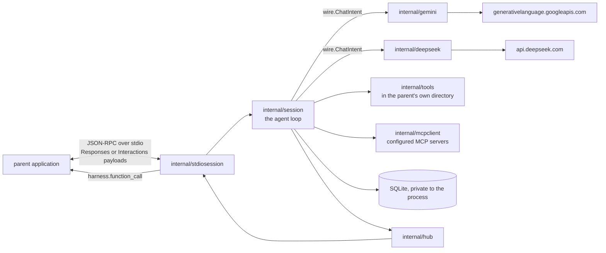

# Architecture

Where things live and what they may depend on. Why they are that way is
[`docs/DESIGN.md`](docs/DESIGN.md), and § references below point into it.

## Overview

`harness stdio-session` is one process hosting one coding session for a parent
application, driven over stdin and stdout. The parent spawns it, owns the
working directory, names that directory on each create call, and gets the
session's whole event stream back. The agent loop reads and writes files and
runs commands in there, and publishes a result. There is no queue, no worker
pool, no HTTP listener and no web UI — it is `internal/session` and its tools,
with a protocol translator either side.

The protocol is the OpenAI Responses API's own vocabulary rather than one of
this repo's invention: the methods are its REST methods on `POST /responses`,
and the notifications are that surface's semantic server-sent events.
[`docs/STDIO-PROTOCOL.md`](docs/STDIO-PROTOCOL.md) is the wire reference.

**It is the same vocabulary underneath.** `internal/deepseek` posts to
DeepSeek's own `POST /responses`
([`docs/DEEPSEEK-RESPONSES.md`](docs/DEEPSEEK-RESPONSES.md)), and so does the
loop's own conversation form: `internal/fold` produces `[]wire.Item`, the
Responses input-item shape, which that client serialises without rebuilding.
The Chat Completions dialect renders *from* items with
`wire.MessagesFromItems`, and `internal/gemini` renders Interactions steps
from them.

It is still not a proxy. The loop runs the tools, so what a parent reads is
rendered from the session's event log rather than forwarded from a provider,
and a create's `input` reaches the loop as a plain string. What one
vocabulary buys is one set of shapes and one place a mistake in them can
hide.

That vocabulary is the wire's, not the model's. The process hosts every
Gemini model the harness routes and one DeepSeek model,
`deepseek-v4-flash-vision-exp`, chosen by the create body's `model` and
dispatched to a client per provider; the parent supplies whichever keys it
wants usable. DeepSeek's other two models are refused rather than hosted,
because neither reads images and a session on such a model is given the
vision tools that compensate — four of which send their images to Google, so
hosting one would mean a DeepSeek run needing a Google key as well
([`docs/DEEPSEEK-VISION.md`](docs/DEEPSEEK-VISION.md)).



One property shapes the arrangement: the head of every request — system prompt,
then tool array — is byte-identical across sessions and frozen for a session's
life, and the message array only ever grows at the end (§3.2). Packages are
split so that nothing on the request path can perturb that head. Skills render
into the opening user message rather than the system prompt. Permission changes
which tool calls *run*, never which tools are *offered*. A resumable session
stores the prompt and schema it was created with, so a harness upgrade cannot
rewrite its prefix.

Three more things are worth knowing before changing anything near the
protocol:

- **The loop is shared, not forked.** `session.Runner` is used unmodified. The
  one widening it needed was `tools.WithCallID`, a context value carrying the
  running call's own id, so the provider that answers a call by asking the
  parent to run it can name the call it is serving.
- **It has a SQLite store, and that is not a contradiction.** The loop's state
  machine *is* its event log: steering, resume, compaction and the fold all
  read it. The store here is that log and nothing else — nothing serves a
  queue from it and nothing reads it over HTTP. It lives under a directory
  the process owns and is removed on exit unless the parent named one with
  `-state-dir`.
- **It works in the parent's directory.** Nothing clones and nothing leases.
  `tools.NewExecutor` resolves that path and confines every file operation
  under it, `internal/skills` and `internal/claudemd` discover from it,
  `Screenshot` and `Crop` write under its `scratch/`, and
  `internal/attachment` addresses files by paths relative to it. What a
  hosted session gives up is the reason a per-run clone existed: an agent in
  `full` mode is loose in a repository somebody is editing, with no copy to
  throw away. That is the parent's problem to solve, and the permission mode
  is the whole of what this protocol gives it to solve it with.

The binary is a subcommand of `cmd/harness` rather than its own `cmd/`, so
that composition happens in one place (`internal/CLAUDE.md`).

## Codemap

One entry per package — what it is for, what it may depend on, and the
`docs/DESIGN.md` section behind it — now lives beside the code it describes,
in [`internal/CLAUDE.md`](internal/CLAUDE.md), so an agent editing a package
loads the map for it without being handed the whole document.

## How the pieces relate

Dependencies run one way, and Go's own `internal` visibility plus the absence of
cycles is the only enforcement — there is no import linter.

```
wire     pricing  skills   claudemd  store   attachment   (no internal dependencies)
  ↑          ↑        ↑        ↑        ↑         ↑
deepseek    │        │        │        │         │
  ↑         │        │      fold       │         │
 tools ─────┴────────┼────────┤        │         │
  ↑                  │        │        │         │
session ─────────────┴────────┴────────┤         │
  ↑                                    │         │
stdiosession ← hub ──────────────────┘         │
  ↑                                              │
mcpclient ───────────────────────────────────────┘  (store, wire, tools)
```

`deepseek`, `tools`, `session`, and `fold` all read their vocabulary from
`wire` — the client, the tool array, the agent loop, and the fold, each one
level above the shared types. `deepseek`'s row stands for three sibling
packages, not one: `internal/kimi` and `internal/gemini` sit at the same
level, reading `wire` directly and depending on nothing else internal.
`cache` and `promptvariant` import `wire` directly as well, and `provider` —
the model→provider table both client construction and request validation
consult (docs/KIMI-INTEGRATION.md §4.3) — is a leaf beside it.

The edges that matter:

- **`internal/session` is the only package that speaks to both the model API
  and the tools**, and its reach to the API is through the narrow `Client`
  seam it declares: `internal/deepseek`, `internal/kimi`, and
  `internal/gemini` each implement it independently, turning the loop's
  `wire.ChatIntent` into that provider's own request shape and owning that
  provider's usage mapping and response quirks, and `cmd/harness` chooses
  the implementation a session's model resolves to when it builds the
  Runner (docs/KIMI-INTEGRATION.md §4.1, docs/GEMINI-INTEGRATION.md §5.1). A
  change that needs both belongs there.
- **`internal/mcpclient` sits above `internal/store`, `internal/wire`, and
  `internal/tools`.** It reads the `mcp_servers` rows, speaks the tool-array
  vocabulary, and implements `MCPProvider`, the narrow seam `internal/tools`
  declares — the same declared-seam shape `Client` takes, with `cmd/harness`
  wiring the one concrete `Manager` into `internal/session`
  ([`docs/MCP.md`](docs/MCP.md)).
- **`internal/stdiosession` sits above the loop and knows the parent's
  vocabulary — both of them.** It speaks the Responses API's and Google's
  Interactions API's behind one `Dialect` seam, chosen by the subcommand.
  Nothing below it knows which, and it reaches the model only through the
  loop.
- Nothing imports `cmd/`.

## Cross-cutting concerns

**Configuration.** The parent configures the process: credentials in the
environment it spawns it with, everything else on the command line. The
`settings` table and `internal/settings`' registry still carry the run
budgets, tool limits and model names the loop reads, resolved through the
store on every call. The API keys are deliberately not among them — a
`-state-dir` a parent keeps for resuming must not become a file holding a
plaintext key, so they stay closures over local variables.

**Pricing.** Never compiled in. The table loads from the path `-prices`
names and carries a capture date the cost readout shows, because a cost
computed from a stale table looks authoritative and is wrong. A missing table
costs the cost figure on `harness.usage` and nothing else.

**Permission.** A policy the session holds for its whole life, evaluated in Go
at the moment of a tool call. A denial is unconditional and returns through
the tool result channel for the model to route around — a session never
blocks on a human. Two modes, `readonly` and `full`, plus optional deny
patterns from the request. §4.6.

**Persistence and observability.** Every event lands in SQLite inside a
transaction, then appends to the disk mirror; a failed mirror write logs and
does not fail the run. Reasoning is stored verbatim and never truncated,
because it goes back to the API.

## Invariants

Properties that must hold. Most are invisible in the code, which is why they
are here.

- **The request head is frozen.** System prompt and tool array are rendered at
  session creation, stored on the `sessions` row, and never recomputed. Adding a
  tool, reordering the array, or reworded prompt text is a cache-prefix change
  for every session (§3.2, [`docs/CACHE.md`](docs/CACHE.md)).
- **A session's MCP tools are resolved once, at `Run`.** The array is built
  from the *stored* `mcp_servers` snapshot, not a live connection, marshalled
  onto the session row alongside the rest of the frozen head, and read back
  from that row on resume rather than re-resolved — a server an operator
  toggles mid-run cannot change what the run is sending
  ([`docs/MCP.md`](docs/MCP.md), "Resolution happens once per run").
- **`tools_json` is only ever written by a successful probe.** A failed probe
  writes `probe_error` and leaves the snapshot alone, so an MCP server that is
  enabled but briefly unreachable contributes the tools it contributed last
  time rather than silently shrinking the frozen head out from under a
  session that is about to freeze it
  ([`docs/MCP.md`](docs/MCP.md), "The tool array is built from a stored
  snapshot").
- **A session row can exist before its workspace does.** `Runner.Create`
  inserts the row as `creating`, so a run is visible and stoppable during
  preparation; `Runner.Run` promotes it to `running` and writes the system
  prompt and tool schema once the workspace is ready. "Live" is always
  `running` or `creating` (`store.IsLive`), never a literal comparison.
- **The message array is append-only.** Nothing edits or removes an earlier
  message. Compaction starts a new session rather than rewriting one.
- **`tool_choice` is never sent.** Thinking mode rejects `required` and
  named-tool forcing, so no tool can be forced; the system prompt asks instead.
- **Assistant messages carrying `tool_calls` have `""` content, never `null`.**
- **Tool results append in `tool_calls` array order**, regardless of which
  finished first. Parallel calls cannot be disabled, so ordering is what
  protects the prefix.
- **The skills catalogue goes in the opening user message, never the system
  prompt**, and there is no `Skill` tool — a twelfth tool definition would
  enlarge the frozen head to duplicate what `Read` already does (§4.11).
- **A `usage` event is one request, not one sub-turn.** The reasoning-starved
  retry (§4.5) sends a second request for the same sub-turn and the API bills
  both, so that turn commits two, sharing `sub_turn` and told apart by
  `attempt`. A cost total sums every event; anything wanting the turn's
  standing state — the cache detector on resume — takes the last.
- **Run control needs no seam.** Steering is a store write by the protocol
  handler and a store read by the loop, with the database as the boundary;
  stopping cancels the run's context in this process (docs/RUN-CONTROL.md).
- **A hosted session works in a directory it did not create.**
  `harness stdio-session` sets `RunOptions.Workspace` to the directory its
  parent named. Nothing on the session path may come to assume a workspace
  root the harness itself laid out — a `scratch/` directory, a cloned
  repository, a lease. The loop is passed a path and only a path.
- **`internal/stdiosession` is the only place a parent's wire vocabulary is
  spoken outbound,** and `internal/deepseek` and `internal/gemini` are the
  only places a provider's is spoken inbound. That the same two vocabularies
  appear on both sides is a convenience and not a passthrough: neither end
  knows about the other, and `internal/session` knows about neither. It
  states intent as `wire.ChatIntent` and records `store.Event`s, and the
  translation in both directions happens at the edges.
- **The vendored mirror in `third_party/deepseek-docs/` is generated.** Refresh
  it by re-scraping, never by editing a file.

## Gotchas

**`status: "ok"` does not mean the model succeeded.** `complete_status` is a
separate field mirroring what the model said about finishing: `gave_up` is a run
that completed cleanly and reported failure. Empty is normal, because `Complete`
cannot be forced. A caller checking only `status` cannot tell the two apart.

**The `denied` result status is unused.** It described a workspace-lease
conflict that a per-run directory made impossible. Don't build on it.

**A sub-turn's text reaches a watcher twice, by two different routes.**
`session/turn.go` accumulates a sub-turn's reasoning and content in Go and
commits one `reasoning_delta` and one `content_delta` event at the end, so the
*event log* gets the text in one burst per sub-turn. Alongside that, `liveSink`
publishes the same text to the hub as it arrives, coalesced on an interval and
always flushed before the sub-turn ends, as `hub.LiveDelta` frames that are
never stored. A consumer wanting text at something like token rate reads the
live frames; a consumer wanting the authoritative record reads the events; a
consumer wanting both must not count the text twice. `internal/stdiosession`
does exactly that split — live frames for the text, events for the structure —
and its own doc comment says why.

**`session_started` carries the skills catalogue alongside the opening
message,** as an exact substring of it, so a client can lift it into a panel
of its own without parsing prose.

**A configured MCP server reaches outside the workspace by definition.** The
built-in tools are confined to it (paths resolve and are checked for escape
there, `docs/TOOLS.md` "Execution rules"); an MCP tool is under no such
constraint — it can read, write, or drive anything the server it calls into
can reach. A `full`-mode session with a server configured is therefore a
wider grant than the workspace confinement the rest of the tool array
promises ([`docs/MCP.md`](docs/MCP.md) "Permissions").

**The stdio transport spawns a subprocess on this machine.** `uvx <package>`
or `npx <package>` has to resolve on this process's own `PATH` and reach
whatever it is bridging to over this machine's network.

**A resumed session has one `session_started` event per run**
(docs/RUN-CONTROL.md "Continuing"). `internal/fold` turns every one of them
into a plain user message, because that is what each is to the model; a
client rendering a transcript has to decide for itself which of them opened
the session.
