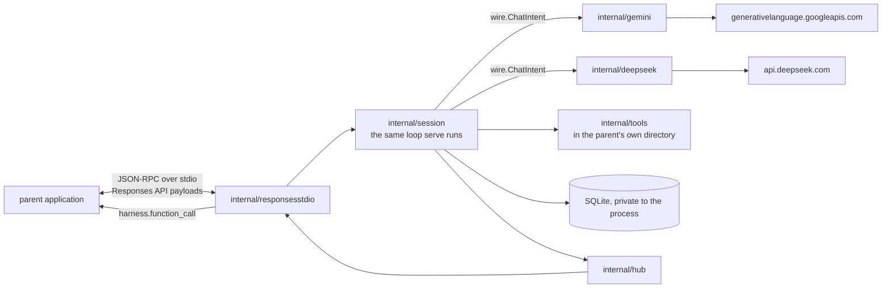

# Architecture

Where things live and what they may depend on. Why they are that way is
[`docs/DESIGN.md`](docs/DESIGN.md), and § references below point into it.

## Overview

A work request names a prompt, one or more repositories, and a permission mode.
The harness clones those repositories into a directory of its own, runs an agent
loop that reads and writes files and runs commands in there, and publishes a
result. Requests arrive on the durable work queue — the `work_queue` table in
serve's SQLite store — and results are recorded on the request's
`work_requests` row. A browser can watch, change settings, and start, steer,
continue, and stop a run. Start, continue and stop act on the run through two
declared seams (docs/RUN-CONTROL.md): `RunPublisher`, a narrow interface
declared in `internal/httpapi` and implemented by `cmd/harness` over the
store-backed queue, enqueues a validated work request — a start, or a
continuation naming the session it resumes; and
`RunController`, declared in `internal/httpapi` and implemented by
`*worker.Pool`, ends a run in this process. Steer needs no seam at all — it is
a store write by the handler and a store read by the loop, with the database
as the boundary.

One binary, `harness`, is every entry point. `serve` is the long-running
service below; `stdio-session` is the second way a run can start and has its
own section; `worktree` is repo development infrastructure — allocating the
ports and compose project names sibling git worktrees need
([`docs/WORKTREES.md`](docs/WORKTREES.md)) — and out of scope for the rest of
this document.

- **`harness serve`** — the worker pool, the SQLite store, the HTTP
  surface, and the MCP launch server, in a single process. It serves the web
  UI, `/api/...`, and `/mcp` on one HTTP port; the embedded MCP service lets
  an external agent harness launch and collect runs through the same queue
  and the same HTTP API. It holds no database handle of its own — `serve` is
  the single writer. Concurrent sessions are goroutines, not child processes
  (§4.5). The other direction is a separate thing sharing only the name: a
  session's own tool array can pull in tools from MCP servers the operator
  has configured, through `internal/mcpclient` rather than through anything
  above ([`docs/MCP.md`](docs/MCP.md)).

```mermaid
flowchart LR
    caller[browser start form / MCP client] -->|POST /api/runs| http
    http[internal/httpapi<br/>SSE; GET/HEAD, writes, run control] -->|enqueue| WORK[(work_queue table)]
    WORK --> worker[internal/worker pool]
    worker --> ws[internal/workspace<br/>clone per session]
    worker --> session[internal/session<br/>agent loop]
    session -->|wire.ChatIntent| ds[internal/deepseek, internal/kimi,<br/>internal/gemini clients<br/>each implements the Client seam]
    ds --> api[api.deepseek.com /<br/>api.moonshot.ai /<br/>generativelanguage.googleapis.com]
    session --> tools[internal/tools<br/>in the workspace]
    session --> mcpclient[internal/mcpclient<br/>configured MCP servers]
    mcpclient --> store
    session --> store[(SQLite + disk mirror)]
    session --> hub[internal/hub]
    store --> http
    http --> web[web/ React]
    caller -->|GET /api/requests/{id}| http
```

One property shapes the arrangement: the head of every request — system prompt,
then tool array — is byte-identical across sessions and frozen for a session's
life, and the message array only ever grows at the end (§3.2). Packages are
split so that nothing on the request path can perturb that head. Skills render
into the opening user message rather than the system prompt. Permission changes
which tool calls *run*, never which tools are *offered*. A resumable session
stores the prompt and schema it was created with, so a harness upgrade cannot
rewrite its prefix.

### `harness stdio-session`: one session hosted by another application

The queue is not the only way a run starts. `stdio-session` is one process
that hosts one session for a parent application, driven over stdin and stdout:
the parent spawns it, owns the working directory, and gets the session's whole
event stream back. There is no queue, no worker pool, no HTTP listener and no
web UI — it is `internal/session` and its tools, with a protocol translator
either side.

The protocol is the OpenAI Responses API's own vocabulary rather than one of
this repo's invention: the methods are its REST methods on `POST /responses`,
and the notifications are that surface's semantic server-sent events.
[`docs/STDIO-PROTOCOL.md`](docs/STDIO-PROTOCOL.md) is the wire reference and
the record of where it departs from the HTTP surface and why.

**It is the same vocabulary underneath.** `internal/deepseek` posts to
DeepSeek's own `POST /responses`, so a `function_call` item the parent reads
is the `function_call` item the provider was sent and nothing between them
translates ([`docs/DEEPSEEK-RESPONSES.md`](docs/DEEPSEEK-RESPONSES.md)). The
Gemini models the process also hosts are translated into it by
`internal/gemini`, which is the one place a second vocabulary still lives.

That vocabulary is the wire's, not the model's. The process hosts every
Gemini model the harness routes and one DeepSeek model,
`deepseek-v4-flash-vision-exp`, chosen by the create body's `model` and
dispatched to a client per provider exactly as `serve` does; the parent
supplies whichever keys it wants usable. DeepSeek's other two models are
refused rather than hosted, because neither reads images and a session on
such a model is given the vision tools that compensate — four of which send
their images to Google, so hosting one would mean a DeepSeek run needing a
Google key as well ([`docs/DEEPSEEK-VISION.md`](docs/DEEPSEEK-VISION.md)).



Three things about it are worth knowing before changing anything near it:

- **It shares the loop; it does not fork it.** `session.Runner` is used
  unmodified. The one widening it needed was `tools.WithCallID`, a context
  value carrying the running call's own id, so the provider that answers a
  call by asking the parent to run it can name the call it is serving.
- **It has a SQLite store, and that is not a contradiction.** The loop's state
  machine *is* its event log: steering, resume, compaction and the fold all
  read it. The store here is that log and nothing else — no `work_queue` is
  served from it, no pool claims from it, nothing reads it over HTTP. It lives
  under a directory the process owns and is removed on exit unless the parent
  named one.
- **It works in the parent's directory.** Nothing clones and nothing leases:
  `internal/workspace` is not on this path at all — it is the worker's, not
  the loop's, and `Runner.Run` has only ever taken a path. What that path
  buys, and therefore what a hosted session gives up, is worth stating:
  `tools.NewExecutor` resolves it and confines every file operation under it,
  `internal/skills` and `internal/claudemd` discover from it, `Screenshot` and
  `Crop` write under its `scratch/`, and `internal/attachment` addresses files
  by paths relative to it. All of that works unchanged against a directory the
  parent named. The two things that do not survive are the *reason* the worker
  clones: an agent in `full` mode is loose in a repository somebody is
  editing, with no per-run copy to throw away and no lease stopping two
  sessions sharing it. That is the parent's problem to solve and the
  permission mode is the whole of what this protocol gives it to solve it
  with.

The binary is a subcommand of `cmd/harness` rather than its own `cmd/`.
Composition happens in `cmd/harness` and nowhere else (`internal/CLAUDE.md`),
and a second `cmd/` would be a second composition root building its own
provider client, store and runner — two places to keep in step every time the
loop gains a dependency. One binary also means one thing to build and one
thing for a parent to find on disk.

## Codemap

One entry per package — what it is for, what it may depend on, and the
`docs/DESIGN.md` section behind it — now lives beside the code it describes,
in [`internal/CLAUDE.md`](internal/CLAUDE.md), so an agent editing a package
loads the map for it without being handed the whole document.

## How the pieces relate

Dependencies run one way, and Go's own `internal` visibility plus the absence of
cycles is the only enforcement — there is no import linter.

```
wire     pricing  skills   claudemd store    webassets     (no internal dependencies)
  ↑          ↑        ↑        ↑        ↑        ↑
deepseek    │        │        │        │        │
  ↑         │        │     fold        │        │
 tools ─────┘        │        │        │        │
  ↑                  │        │        │        │
 queue               │        │        │        │       httpapi ← hub
  ↑                  │        │        │        │
workspace       session ──────┘        │        │
  ↑                  ↑                 │        │
 worker ─────────────┘                 │        │
                                       │        │
 mcp ──────────────────────────────────┘        │  (types only)

 mcpclient ─────────────────────────────┘        │  (store, wire, tools)
```

`deepseek`, `tools`, `session`, and `fold` all read their vocabulary from
`wire` — the rows above are the client, the tool array, the agent loop, and
the fold, each one level above the shared types. `deepseek`'s row stands for
three sibling packages now, not one: `internal/kimi` and `internal/gemini`
sit at the same level, reading `wire` directly and depending on nothing else
internal, the same way `internal/deepseek` does. `cache`, `evals`, and
`promptvariant` import `wire` directly as well, and `provider` — the
model→provider table both client construction and request validation
consult (docs/KIMI-INTEGRATION.md §4.3) — is a leaf beside it. The loop's
reach to a provider client runs through a declared seam rather than a direct
import: `internal/session` declares a narrow `Client` interface it consumes,
and `internal/deepseek`, `internal/kimi`, and `internal/gemini` each
implement it independently — turning the loop's `wire.ChatIntent` into that
provider's own request shape — with `cmd/harness` choosing which
implementation a given model resolves to when it builds the Runner
(docs/KIMI-INTEGRATION.md §4.3, docs/GEMINI-INTEGRATION.md §5.1) — the same
declared-seam shape `RunPublisher` and `RunController` take
(docs/KIMI-INTEGRATION.md §4.1).

The edges that matter:

- **`internal/httpapi` imports neither `session` nor `worker`.** It reaches the
  store and the hub, for both reads and writes, and neither of those reaches
  session or worker. That import boundary — not the absence of write endpoints
  — is what keeps run control a declared seam rather than a reach into a
  running loop, and it is why the boundary survived the read-only rule being
  retired. Run control goes through seams declared here deliberately rather
  than by an import appearing: the stop endpoint holds a narrow `RunController`
  interface implemented by `*worker.Pool`, and the start endpoint holds a
  narrow `RunPublisher` interface implemented by `cmd/harness` over the
  store-backed queue (docs/RUN-CONTROL.md), exactly the shape `QueuePool`
  already uses for `/api/queue`. Steering is the exception that
  proves the rule — it needs no seam because it is a store write by the
  handler and a store read by the loop, and the store is already here.
- **`internal/session` is the only package that speaks to both the model API
  and the tools**, and its reach to the API is through the narrow `Client`
  seam it declares: `internal/deepseek`, `internal/kimi`, and
  `internal/gemini` each implement it independently, turning the loop's
  `wire.ChatIntent` into that provider's own request shape and owning that
  provider's usage mapping and response quirks, and `cmd/harness` chooses
  the implementation a session's model resolves to when it builds the
  Runner — the same declared-seam shape `RunPublisher` and `RunController`
  take (docs/KIMI-INTEGRATION.md §4.1, docs/GEMINI-INTEGRATION.md §5.1). A
  change that needs both belongs there.
- **`internal/mcpclient` sits above `internal/store`, `internal/wire`, and
  `internal/tools`.** It reads the `mcp_servers` rows, speaks the tool-array
  vocabulary, and implements `MCPProvider`, the narrow seam `internal/tools`
  declares — the same declared-seam shape `Client`, `RunPublisher`, and
  `RunController` take, with `cmd/harness` wiring the one concrete `Manager`
  into `internal/session`. `internal/httpapi` reaches it only through a
  second, narrower seam it declares for itself, `MCPProber`, so it can
  trigger a probe from the `/mcp-servers` screen without gaining a path into the
  running loop — the "imports neither `session` nor `worker`" boundary above
  holds exactly as before ([`docs/MCP.md`](docs/MCP.md)).
- **`internal/worker` is the only package that acks a queue message.**
- Nothing imports `cmd/`.

## Cross-cutting concerns

**Configuration.** Two sources, and the split is deliberate. Bootstrap —
where the database lives, where the service binds, the price table path,
the workspace root — comes through `internal/config` from the environment,
with `.env` loaded best-effort at startup and real environment variables
winning over it. Everything operator-tunable — API
keys, models, run budgets, tool limits, worker sizes, retention — lives in
the `settings` table and resolves through `internal/settings`' registry, so
an operator changes a limit on the settings screen (or with a direct `PUT`)
without a rebuild. Settings marked "requires a restart" are read once
at startup and the UI says so. Names and defaults are documented in
`.env.example` and in the registry itself.

**Pricing.** Never compiled in. The table loads from the path in
`DEEPSEEK_PRICE_TABLE` and carries a capture date that the cost readout shows,
because a cost computed from a stale table looks authoritative and is wrong.

**Permission.** A policy the session holds for its whole life, evaluated in Go
at the moment of a tool call. A denial is unconditional and returns through
the tool result channel for the model to route around — a session never
blocks on a human. Two modes, `readonly` and `full`, plus optional deny
patterns from the request. §4.6.

**Persistence and observability.** Every event lands in SQLite inside a
transaction, then appends to the disk mirror; a failed mirror write logs and
does not fail the run. Reasoning is stored verbatim and never truncated,
because it goes back to the API.

## Invariants

Properties that must hold. Most are invisible in the code, which is why they
are here.

- **The request head is frozen.** System prompt and tool array are rendered at
  session creation, stored on the `sessions` row, and never recomputed. Adding a
  tool, reordering the array, or reworded prompt text is a cache-prefix change
  for every session (§3.2, [`docs/CACHE.md`](docs/CACHE.md)).
- **A session's MCP tools are resolved once, at `Run`.** The array is built
  from the *stored* `mcp_servers` snapshot, not a live connection, marshalled
  onto the session row alongside the rest of the frozen head, and read back
  from that row on resume rather than re-resolved — a server an operator
  toggles mid-run cannot change what the run is sending
  ([`docs/MCP.md`](docs/MCP.md), "Resolution happens once per run").
- **`tools_json` is only ever written by a successful probe.** A failed probe
  writes `probe_error` and leaves the snapshot alone, so an MCP server that is
  enabled but briefly unreachable contributes the tools it contributed last
  time rather than silently shrinking the frozen head out from under a
  session that is about to freeze it
  ([`docs/MCP.md`](docs/MCP.md), "The tool array is built from a stored
  snapshot").
- **A queue-driven run's session row exists before its workspace does.** The
  worker creates the row as `creating` before cloning (§4.10), so the run is
  visible on the session list and stoppable during preparation; `Runner.Run`
  promotes it to `running` and writes the system prompt and tool schema once
  the workspace is ready. "Live" is always `running` or `creating`
  (`store.IsLive`; `isLive` in the frontend), never a literal comparison.
- **The message array is append-only.** Nothing edits or removes an earlier
  message. Compaction starts a new session rather than rewriting one.
- **`tool_choice` is never sent.** Thinking mode rejects `required` and
  named-tool forcing, so no tool can be forced; the system prompt asks instead.
- **Assistant messages carrying `tool_calls` have `""` content, never `null`.**
- **Tool results append in `tool_calls` array order**, regardless of which
  finished first. Parallel calls cannot be disabled, so ordering is what
  protects the prefix.
- **The skills catalogue goes in the opening user message, never the system
  prompt**, and there is no `Skill` tool — a twelfth tool definition would
  enlarge the frozen head to duplicate what `Read` already does (§4.11).
- **A `usage` event is one request, not one sub-turn.** The reasoning-starved
  retry (§4.5) sends a second request for the same sub-turn and the API bills
  both, so that turn commits two, sharing `sub_turn` and told apart by
  `attempt`. A cost total sums every event; anything wanting the turn's
  standing state — the cache detector on resume — takes the last.
- **The HTTP API serves `GET` and `HEAD` on every path, and the writing
  methods only where a write route exists.** The four actions that touch a
  run are `POST /api/runs`, which enqueues a validated work request through
  the declared `RunPublisher` seam; `POST /api/sessions/{id}/resume`, which
  enqueues one naming an existing session through the same seam, so continuing
  a session needs no third seam and no affinity to the process that ran it;
  `POST
  /api/sessions/{id}/stop`, which goes through the declared `RunController`
  seam; and `POST /api/sessions/{id}/steer`, which is a store write the loop
  reads at its next sub-turn boundary — all authenticated by a bearer token
  (docs/RUN-CONTROL.md). A POST anywhere else stays a 405 with a correct
  `Allow` header.
- **`internal/mcp` opens no SQLite handle.** `harness serve` is the single
  writer.
- **`parent_is_user` is producer-stamped.** It is set by the two producers —
  the browser's `POST /api/runs` and the MCP `deepseek_agent` tool — never by
  a request body or a tool input, and never inherited from anything a calling
  agent asserts. `parent_agent_type` remains caller-asserted and is therefore
  not trustworthy the way `parent_is_user` is.
- **A hosted session works in a directory it did not create.**
  `harness stdio-session` sets `RunOptions.Workspace` to the directory its
  parent named and never calls `internal/workspace`. Nothing on the session
  path may come to assume a workspace root the harness itself laid out — a
  `scratch/` directory, a cloned repository, a lease. Both entry points pass a
  path and only a path.
- **`internal/responsesstdio` is the only place the parent's wire vocabulary is
  spoken outbound.** `internal/gemini` speaks it inbound, to the API. Neither
  knows about the other, and `internal/session` knows about neither: it states
  intent as `wire.ChatIntent` and records `store.Event`s, and the translation
  in both directions happens at the edges.
- **`internal/webassets/dist` is build output.** Never hand-edit it; never
  commit anything there but `.gitkeep`.
- **The vendored mirror in `third_party/deepseek-docs/` is generated.** Refresh
  it by re-scraping, never by editing a file.

## Gotchas

**A `go build` with no frontend build first produces a binary that serves
nothing.** `go:embed` bakes in whatever is in `internal/webassets/dist` at
compile time, and git holds only a `.gitkeep` there. The directory itself is
tracked because `go:embed` will not compile against a missing one. Run
`npm --prefix web run build`, or build the image, which does it for you.

**`docker compose up -d` without `--build` restarts the old code.** The image
bakes both the frontend and the binary.

**`status: "ok"` does not mean the model succeeded.** `complete_status` is a
separate field mirroring what the model said about finishing: `gave_up` is a run
that completed cleanly and reported failure. Empty is normal, because `Complete`
cannot be forced. A caller checking only `status` cannot tell the two apart.

**The `denied` result status is unused.** It described a workspace-lease
conflict that a per-run directory made impossible. Don't build on it.

**A sub-turn's text reaches a watcher twice, by two different routes.**
`session/turn.go` accumulates a sub-turn's reasoning and content in Go and
commits one `reasoning_delta` and one `content_delta` event at the end, so the
*event log* gets the text in one burst per sub-turn. Alongside that, `liveSink`
publishes the same text to the hub as it arrives, coalesced on an interval and
always flushed before the sub-turn ends, as `hub.LiveDelta` frames that are
never stored. A consumer wanting text at something like token rate reads the
live frames; a consumer wanting the authoritative record reads the events; a
consumer wanting both must not count the text twice. `internal/responsesstdio`
does exactly that split — live frames for the text, events for the structure —
and its own doc comment says why.

**`session_started` yields two display blocks, not one.** The rendered skills
catalogue is carried alongside the opening message as an exact substring of it,
so the browser can lift it into its own panel without parsing prose. That is why
transcript blocks key on sequence number *and* type.

**The host's docker socket is mounted into the harness container.** A session in
`full` mode can therefore do anything to the host daemon, including mounting the
host filesystem into a container it starts. Paths given to `docker run -v` inside
a session name the host, not the container.

**A configured MCP server reaches outside the workspace by definition.** The
built-in tools are confined to it (paths resolve and are checked for escape
there, `docs/TOOLS.md` "Execution rules"); an MCP tool is under no such
constraint — it can read, write, or drive anything the server it calls into
can reach. A `full`-mode session with a server configured is therefore a
wider grant than the workspace confinement the rest of the tool array
promises, on top of the docker-socket grant `full` already carries
([`docs/MCP.md`](docs/MCP.md) "Permissions").

**The stdio transport spawns a subprocess inside the harness container, not
on the operator's machine.** `uvx <package>` or `npx <package>` has to
resolve on the container's own `PATH` and talk to whatever it is bridging to
over the container's own network — both binaries are installed in the image
for exactly this (the Dockerfile's `uv` install), but a server that expects
to reach something running on the operator's host (Blender's own MCP
add-on, listening on `localhost:9876`, is the motivating case) needs that
something reachable from inside the container, not just from the operator's
own terminal. The same rule cuts the other way for a server that shells out
rather than bridges: Blender's `_for_cli` tools run `blender --background`
in *this* container, which is why the image carries Blender itself
([`docs/MCP.md`](docs/MCP.md) "Blender, the worked example").

**The two folds must agree in shape.** `internal/fold` produces the API
`messages` array and `web/src/api/fold.ts` produces display blocks, from the
same event log. A new event kind needs both. The steering pair is the current
example: both folds know `steer_message` and `steer_applied`, and each does
with them what its own consumer needs — the Go fold appends the applied
steer's text as a user message, and the browser fold emits a pending block
and flips it to delivered, which is the one place the browser fold completes a
block it has already emitted (docs/RUN-CONTROL.md "The frontend").

Agreeing in shape is not the same as agreeing block for event, and
`session_started` is where the two diverge on purpose. A resumed session has
one per run (docs/RUN-CONTROL.md "Continuing"): the Go fold turns every one of
them into a plain user message, because that is what each is to the model,
while the browser fold makes the first an opening block and the rest
continuation blocks, because only the first opened the session and the rest
are somebody typing again.
