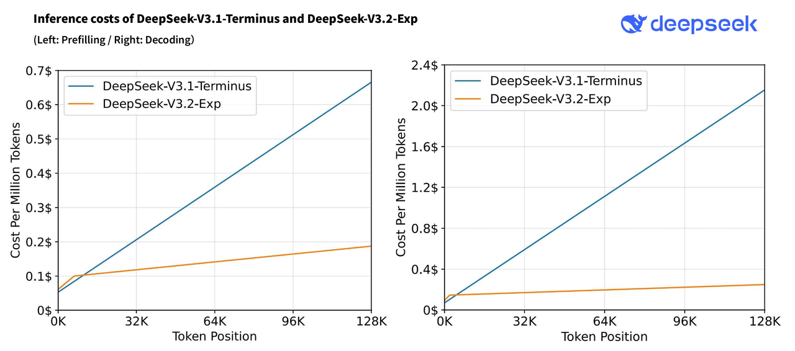
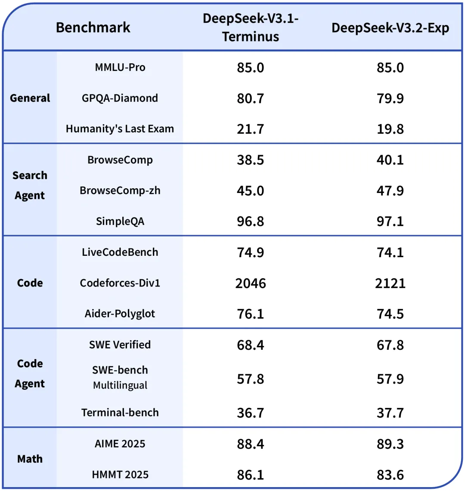
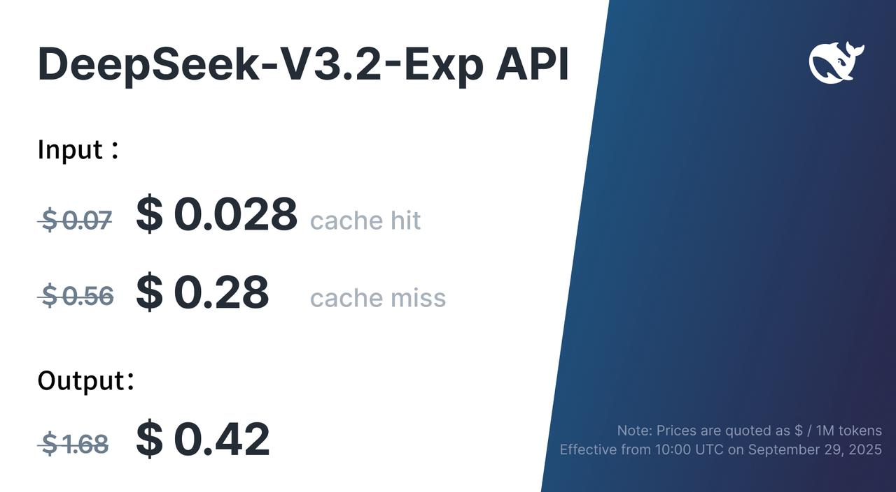

# Introducing DeepSeek-V3.2-Exp

🚀 Introducing DeepSeek-V3.2-Exp — our latest experimental model!

✨ Built on V3.1-Terminus, it debuts DeepSeek Sparse Attention (DSA) for faster, more efficient training & inference on long context.

👉 Now live on App, Web, and API

💰 API prices cut by 50%+!

---

## ⚡️ Efficiency Gains

🤖 DSA achieves fine-grained sparse attention with minimal impact on output quality — boosting long-context performance & reducing compute cost.

📊 Benchmarks show V3.2-Exp performs on par with V3.1-Terminus.

---

## 🧑‍💻 API Update

🎉 Lower costs, same access!

💰 DeepSeek API prices drop 50%+, effective immediately.

🔹 For comparison testing, V3.1-Terminus remains available via a temporary API until Oct 15th, 2025, 15:59 (UTC Time). Details: <https://api-docs.deepseek.com/guides/comparison_testing>

---

## 🛠 Open Source Release

🔗 Model: <https://huggingface.co/deepseek-ai/DeepSeek-V3.2-Exp>

🔗 Tech report: <https://github.com/deepseek-ai/DeepSeek-V3.2-Exp/blob/main/DeepSeek_V3_2.pdf>

🔗 Key GPU kernels in TileLang & CUDA (use TileLang for rapid research prototyping!)
