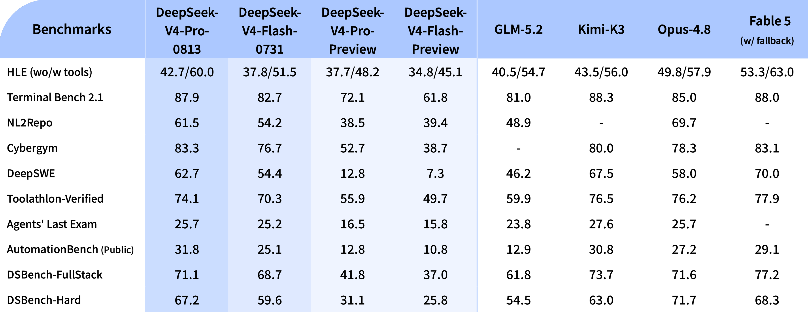
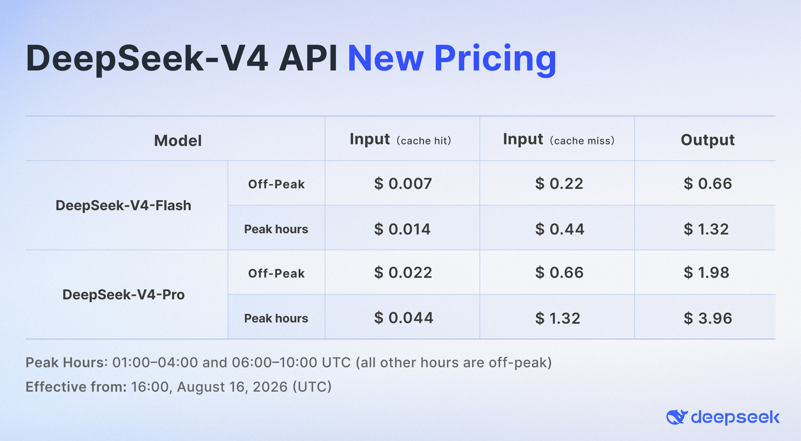

# DeepSeek-V4-Pro GA Release

We’re launching DeepSeek-V4-Pro today! 🚀

🔷 Major Agent upgrades with strong production gains!

🔷 Flexible [reasoning effort](../guides/thinking_mode.md) for V4-Pro & V4-Flash: low for simple tasks, high for daily Agent workflows, max for complex tasks.

🔷 Native OpenAI Responses API support, optimized for [Codex](../quick_start/agent_integrations/codex.md) with one-click setup.

V4 Pro is now available on app/web. Try it via “Expert Mode”.

V4 Pro is also available via API. Model names remain unchanged—please refer to the API docs for setup details.

---

### API pricing update 💰

With the V4 lineup release, we’re updating our API pricing and introducing peak and off-peak rates. Off-peak rates are 50% lower than peak, enabling more flexible workload scheduling. 📉

New pricing takes effect at 16:00 UTC, Aug 16, 2026 🕒

